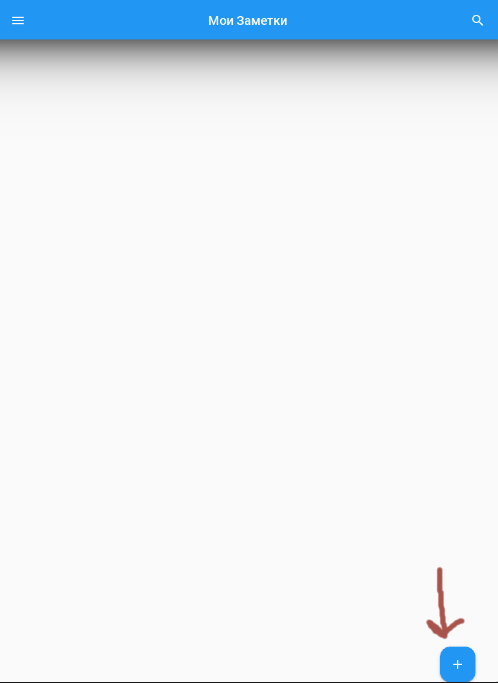
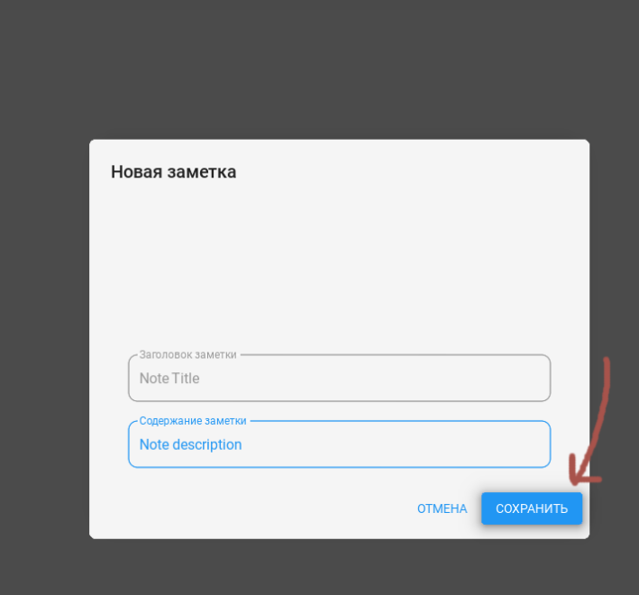
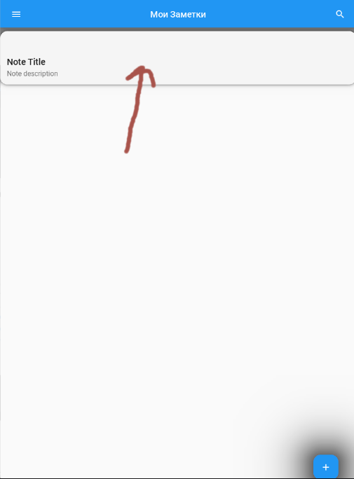
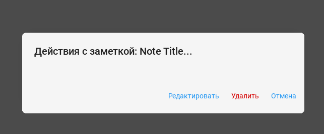
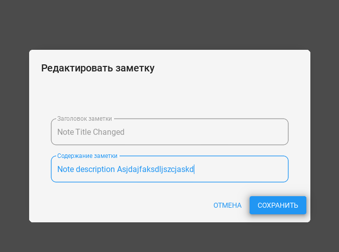
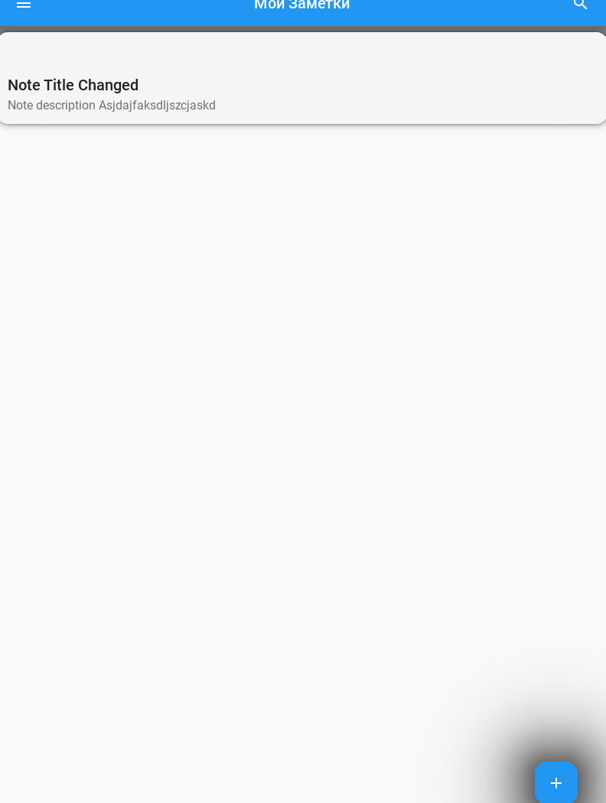
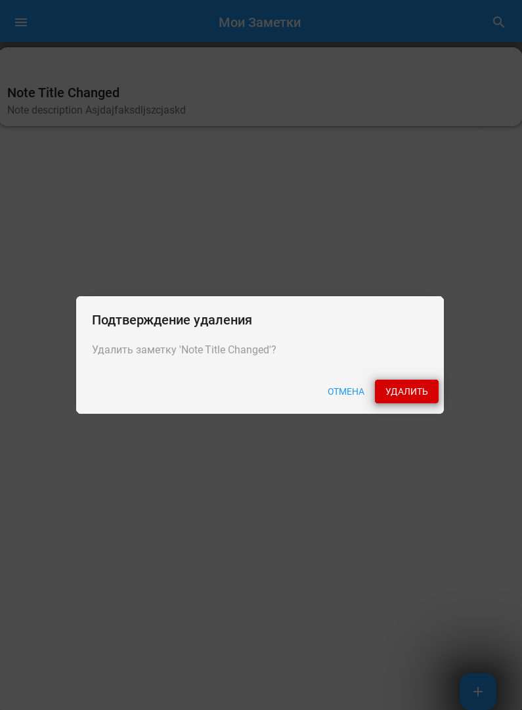
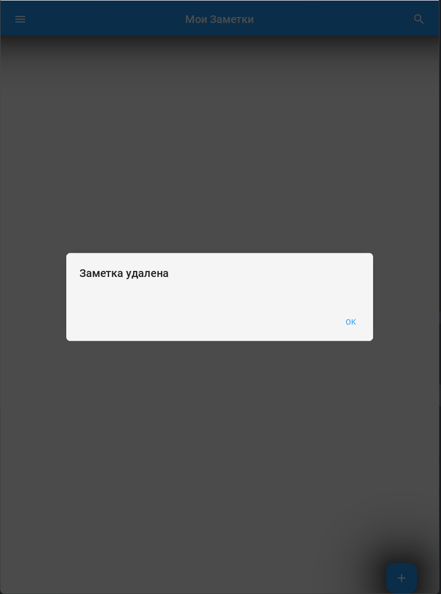

# Сборка с помощью Buildozer
Предварительные требования

# Установите зависимости для Linux (Ubuntu/Debian):
sudo apt update
sudo apt install -y git zip unzip openjdk-8-jdk python3-pip autoconf libtool pkg-config zlib1g-dev libncurses5-dev libncursesw5-dev libtinfo5 cmake libffi-dev libssl-dev

# Установите Buildozer:
pip3 install --user buildozer

# Инициализация Buildozer:
buildozer init

# Соберите приложение:
buildozer -v android debug

# Для сборки в release mode:
buildozer -v android release

# Найдите собранный APK:
find . -name "*.apk"
APK будет находиться в папке bin/

# Установите на Android устройство:

    Включите "Неизвестные источники" в настройках безопасности

    Скопируйте APK на устройство и запустите установку

# Функциональное тестирование

## Тестирование создания заметок:

Нажмите кнопку "+" в правом нижнем углу

Введите заголовок и содержание

Нажмите "СОХРАНИТЬ"

Проверьте, что заметка появилась в списке

## Тестирование редактирования:

Нажмите на существующую заметку

Выберите "Редактировать"

Измените текст и сохраните

Проверьте обновление содержимого

## Тестирование удаления:

Нажмите на заметку

Выберите "Удалить"

Подтвердите удаление

Проверьте, что заметка исчезла из списка

# Тестирование:
## Создание:
Создаем через кнопку плюс в правом нижнем углу

Заполняем поля, подтверждаем

Убеждаемся, что все создалось корректно.

## Редактирование:
Кликаем по созданной записи

Редактируем поля, как хотим

Проверяем, что выполнено корректно

## Удаление:
Кликает по созданной записи, выбираем удаление

Подтверждаем, убеждаемся, что все удалено
